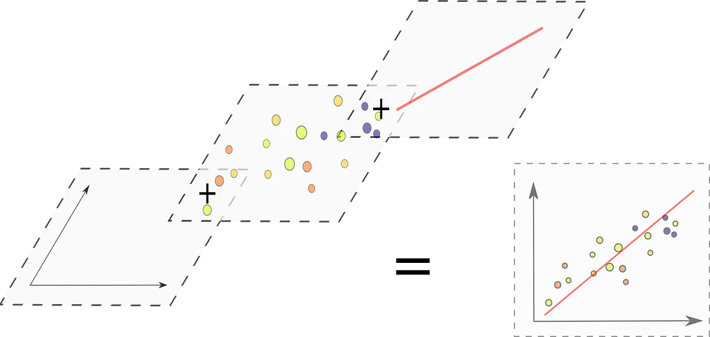

```{r, include = FALSE, message = FALSE}
knitr::opts_chunk$set(
  collapse = TRUE,
  comment = "#>"
)
```

The beauty of the `ggplot2` package is the underlying grammar of graphics, allowing for creation of graphs by stacking multiple layers on top of one another. This powerful concept lets us create essentially any visualization, as long as we know how to code it.



The `ggvanced` package aims to provide a fast way to compare observations across multiple categories at once. To be precise, it contains functions for creation of spider charts and parallel charts. One might think that these can already be obtained using other packages such as `fsmb` and `ggradar` for radar charts and `ggally` for parallel plots. However, none of those gives the ability to simultaneously visualize the range of values for each presented variable.

## Examples

### `ggspider()` 

The `ggspider()` function creates spider charts which either a single shared axis scaled to a [0,1] range, or a separate axis with real values displayed for every displayed category. Let's test the function on a couple of examples. First, we have to format the data so that the first column contains the group identifier, and other columns the descriptory variables. We will use the built-in `mtcars` and `iris` datasets.

```{r}
library(tidyverse)

mtcars_summary <- mtcars %>% 
  tibble::rownames_to_column(var = "group") %>%  
  tibble::as_tibble() %>% 
  tail(3)

iris_summary <- iris %>% 
  dplyr::group_by(Species) %>% 
  dplyr::summarise(across(everything(), mean))
```

```{r}
library(ggvanced)

ggspider(mtcars_summary)
ggspider(iris_summary)
```

As mentioned before, we can also make traditional radar charts with a single common scaled axis by specifying the argument `scaled = TRUE`.

```{r}
ggspider(iris_summary, scaled = TRUE)
```

The shape can also be changed from polygon to round by specifying `polygon = FALSE`.

```{r}
ggspider(iris_summary, polygon = FALSE)
```

The other arguments are more aesthetic in nature, and cover aspects such as font size, position of the labels and so on. For mire details, refer to the function documentation.

### `ggparallel()`

Although I prefer spider charts from an aesthetic viewpoint, parallel charts can make it easier to spot trends across variables. This is especially true when there are many variables or observations in the dataset.

```{r}
ggparallel(mtcars_summary)
ggparallel(iris_summary)
```
